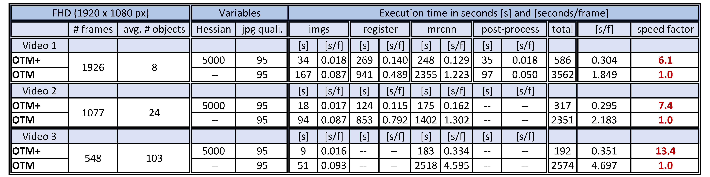
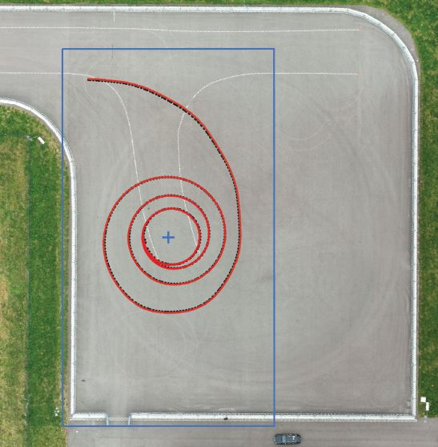
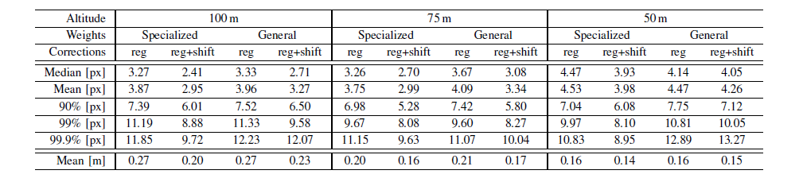

# OpenTrafficMonitoring+
<p align="center">
    
</p>
This is the Detectron2 based implementation supplemented with the following publications:
 
* [Vehicle Position Estimation with Aerial Imagery from Unmanned Aerial Vehicles](http://arxiv.org/abs/2004.08206) (1)
* [Accuracy Characterization of the Vehicle State Estimation from Aerial Imagery](https://arxiv.org/abs/2005.06314) (2)

# What's new
* Code is now completely written in Python - all libraries are open source
* Mask-RCNN: the PyTorch [Detectron2](https://github.com/facebookresearch/detectron2) implementation 
* This implementation yields Linux
* It is faster and requires less GPU RAM
* For the original implementation see [OpenTrafficMonitoring](https://github.com/fkthi/OpenTrafficMonitoring).
* Execution time comparison between original OTM and OTM+ for 3 different videos. OTM+ is faster at all sub-processes. With more objects in an image, the speed gain increases: 
	


# The repository includes:
* Pre-Processing: Images from Video, Image Registration 
* Vehicle Detection: Mask R-CNN built on ResNet50+FPN 
* Pre-trained weights: To reproduce the results from the publications or to directly apply to your own data set
* Post-Processing: Generate rotated bounding Boxes, perform object tracking, estimate vehicle state variables like position, speed, acceleration and orientation
* Plot results: Visualize the bounding boxes and state variables on the images and crate a video output
* Example data used for the publications, see below 

### Contents
* [Which accuracy can be expected?](#which-accuracy-can-be-expected)
* [Installation](#installation)
* [Getting started](#getting-started)
* [Example data and training weights](#example-data-and-training-weights)
* [Apply your own training](#apply-your-own-training)
* [Config](#config)
* [Important Tuning parameters](#important-tuning-parameters)
* [Requirements](#requirements)
* [Citation](#citation)


# Here is one example from the benchmark experiments:

<p align="center">
  
</p>

The figure depicts an bird's eye view on an orthorectified map of the test track at 50 m flight altitude. 
Depicted is the trajectory of the reference in black and drone in red, respectively. 
The car was driven in spirals to capture different vehicle poses and positions in the image frame. 
The blue rectangle and cross indicate the image frame and center. For estimation purposes, a true-to-scale T-junction is painted white on the test track.


# Which accuracy can be expected?
The figure below depicts the error curves we obtained from the experiments in the publications.

	

Here is a detailed Table with position error results from publication (1), where the detection is performed frame-by-frame, i.e. no smoothing/filtering is applied: \


# Installation
1. Install [Detectron2](https://github.com/facebookresearch/detectron2)
1. Clone this repository
2. Install dependencies (take care of the release versions and also the installation order of cv2 and cv2-contrib)
   ```
   pip install -r requirements.txt
   ```
4. Download our weights and store them in the [maskrcnn](src/maskrcnn/) folder.
   The network was trained on approximately 9000 vehicle instances (cars, trucks, busses), mainly from European and Asian data sources. Note: This labeled dataset cannot be provided.


# Getting started
To check if your installation works, try our example video. Open a terminal in the [src](src/) folder and type:

```
python main.py --videos=./videos/:./out/
# '--videos' argument should be in the format: inputfolder:outputfolder
```
This will create a folder named [out] where the output is stored. \
The code supports multiple-video processing: all videos in the [videos](src/videos/) folder are beeing processed sequentially. \
You can also provide images instead of videos:
```
python main.py --images=./images/:./out/ --config=default
# '--config' argument refers to the 'config_name', not video_name !
```
Note that a config must be specified when using images, since the config cannot be inferred by the video name.
# Example data and training weights
One example video is already included in this repository ([DJI_0029_example.mp4](src/videos/)).
For further data, i.e. pre-trained weights, the labeled data of the test vehicle or one complete video from the paper data set,
download the data hosted on the [FAU University](https://www.fau.eu/) server or the mirrors on Google Drive: 
* [Example video frames from publication (1) ~ 6GB](https://faubox.rrze.uni-erlangen.de/getlink/fiU4TAFUx95npBKD9YQxYbai/IEEE_IV_2020_images_example.zip) 
* [Labeled training data set from test track](https://faubox.rrze.uni-erlangen.de/getlink/fi2x2oaNQfM55UgBP2YBB6Vp/IEEE_IV_2020_LabelData_only_A4.zip) | [mirror](https://drive.google.com/file/d/1zJH3q1Jjh91WCCz_wnArgNq2WZkTNeXB/view?usp=sharing)
* [1920x1080 weights](https://faubox.rrze.uni-erlangen.de/getlink/fiSYQEEfhuVgBJjrDixGejUY/model_final_FHD_50kIt_bs2_noAug_790img.pth) or [1280x720 weights](https://faubox.rrze.uni-erlangen.de/getlink/fiBXvL2Rbixu6kwvaz1cMY7q/model_final_HDR_30kIt_bs2_Aug_790img.pth) | [mirror 1080](https://drive.google.com/file/d/19hMb17Uj5JlITUaGo7JEzdmrfV1ugxel/view?usp=sharing) | [mirror 720](https://drive.google.com/file/d/1zCmQz6bkHwNRiJFgymPylP6p558WFtUP/view?usp=sharing)
* Full-HD resolution yields better results
# Apply your own training 
If you want to increase the detection performance, create a labeled training data set and apply transfer learning. \
The easiest way to start is by annotating the data using the open sourced [VIA Image Annotator](http://www.robots.ox.ac.uk/~vgg/software/via). \
To get started with an example, check our [provided labeled data set](https://faubox.rrze.uni-erlangen.de/getlink/fi2x2oaNQfM55UgBP2YBB6Vp/IEEE_IV_2020_LabelData_only_A4.zip) used for the publictations. \
Following steps are necessary to create your training/validation data set with our approach:
1. Label the images with the VIA Image Annotator
2. Export your annotations as COCO JSON file and name the file `via_export_coco.json`. 
3. run `python vgg_to_coco.py` in the [src](src/) folder to get the `transformed.json` annotations (check the inputs and outputs (folders) defined in `vgg_to_coco.py`)
3. Store your training files (images and `transformed.json` annotation file) in a new folder (for example './custom_data'). 
4. Train:

```
# Train from COCO data set 
    python train.py

# Train from our weights
    python train.py --dataset_train=./custom_data/train_data/ --weights=./maskrcnn/model_final.pth
# run python train.py --help for a detailed list of all possible arguments 
```

# Config 
The [config](src/config.py) provides an execution context for every video that gets processed. It contains the
tuning parameters for all the various steps (e.g. drone height, spatial resolution, etc...).

If your videos are very much the same you can just alter the default [config](src/config.py) file. 

You can also create new configs in the src/config.py file and add it to the 'configs_to_consider' list. The different configs are then
chosen by their corresponding 'video_name' (via a simple str.contains()). If no matching config found, the default config is selected.

example:
```
# config.py
new_config_a = default_config.copy({
    "config_name": "config for 50m footage",
    "video_name": "50m",
    "meter_to_pixel": 0.035,
    "drone_height":50,
    # ....
})

new_config_b = default_config.copy({
    "config_name": "config for xyz videos",
    "video_name": "0045",
    "register_images": False,
    "drone_height": 75,
    # ....
})

configs_to_consider = [new_config_a, new_config_b]

```
In this example, we create 2 new configs in src/config.py which differ from the default config by the values we override.
If we were to process the following 3 videos the config mapping would look like this:

- drone_recordings_50m.mp4 -> (uses new_config_a because it contains '50m')
- footage_0045_0001.avi    -> (uses new_config_b because it contains '0045')
- city_20min.mp4      ->    (uses default config since there is no matching config for this video name)


# Important tuning parameters
The output quality is affected by a various number of parameters, see our publications for more details. 
Some of the most important ones are briefly discussed here:
* **Image registration**: To perform the tracking and vehicle state estimation, the video sequence requires a fixed frame. This is reached with image registration.
An important tuning parameter here is the Hessian threshold. To compute the scaling, rotation and translation offsets between two image frames, a certain number of matching 
features has to be found by the algorithm. Lowering the Hessian threshold too much can affect the registration results. Generally, as indirectly shown in the papers by achieving
results with few pixels error, this algorithm is very robust.
* **Ground Sampling Distance** (spatial resolution): Determines the photo resolution, here in cm/px. To obtain best results, we used 3 Ground Control Points and measured the 
distances between the points with D-GPS in RTK mode (~1cm accuracy). The position of these Ground Control Points are then determined in the first image frame in pixels. 
We assume quadratic pixels, so that the conversion from meter to pixel is straight forward. Finally we took the average of the 3 distances from 3 control points. Maximizing the distance between points yields smaller errors.
* **Kalman-Filter** tuning parameters: The tuning parameters are validated for flight heights between 50m and 100m, Full-HD resolution and 50 fps.
* **Clean-Up**: False detections can usually be cleaned up by setting a minimum average speed and number of consecutive detections (see `config.py`). To avoid wicked values when an object
enters the image (due to increasing object size), you can also set the parameter to delete the first n frames.
* **Training / Inference**: Parameters regarding the learning rate, region proposals, max. number of detections, Non-maximum Suppression (NMS) threshold etc. can be tuned in the Detectron2 framework.
Our setup can be checked in `inference.py` and `train.py`, where some variables are beeing override from the default Detectron2 values. 
# Requirements
Detectron2, Python 3.6 or 3.7 and packages listed in `requirements.txt`\
Tested on: 
* Ubuntu 18.04, Python 3.6.9, torch 1.4.0, torchvision 0.5.0, CUDA 10.2, Nvidia 440.x drivers
* Intel Xeon E-2176G, 32 GB RAM, GeForce RTX 2080 Ti, M.2 SDD


# Citation

To cite the this repository:
```
@misc{KruberGithub.2020,
 author = {{F. Kruber} and E. {S\'{a}nchez Morales} and R. {Egolf}},
 date = {2020},
 title = {{OpenTrafficMonitoring+}},
 journal={GitHub repository},
 url = {\url{https://github.com/fkthi}}
}
```

To cite our publications:
```
@INPROCEEDINGS{KruberIV20,
author={F. {Kruber} and E. {S\'{a}nchez Morales} and S. {Chakraborty} and M. {Botsch}},
booktitle={2020 IEEE Intelligent Vehicles Symposium (IV)},
title={{Vehicle Position Estimation with Aerial Imagery from Unmanned Aerial Vehicles}},
year={2020}
}
```
```
@INPROCEEDINGS{SanchezMoralesIV20,
author={E. {S\'{a}nchez Morales} and F. {Kruber} and M. {Botsch} and B. {Huber} and  A. {Garc{\'i}a Higuera}},
booktitle={2020 IEEE Intelligent Vehicles Symposium (IV)},
title={{Accuracy Characterization of the Vehicle State Estimation from Aerial Imagery}},
year={2020}
}
```

# Acknowledgment
The authors acknowledge the financial support by the Federal Ministry of Education and Research of
Germany (BMBF) in the framework of FH-Impuls (project number 03FH7I02IA).
